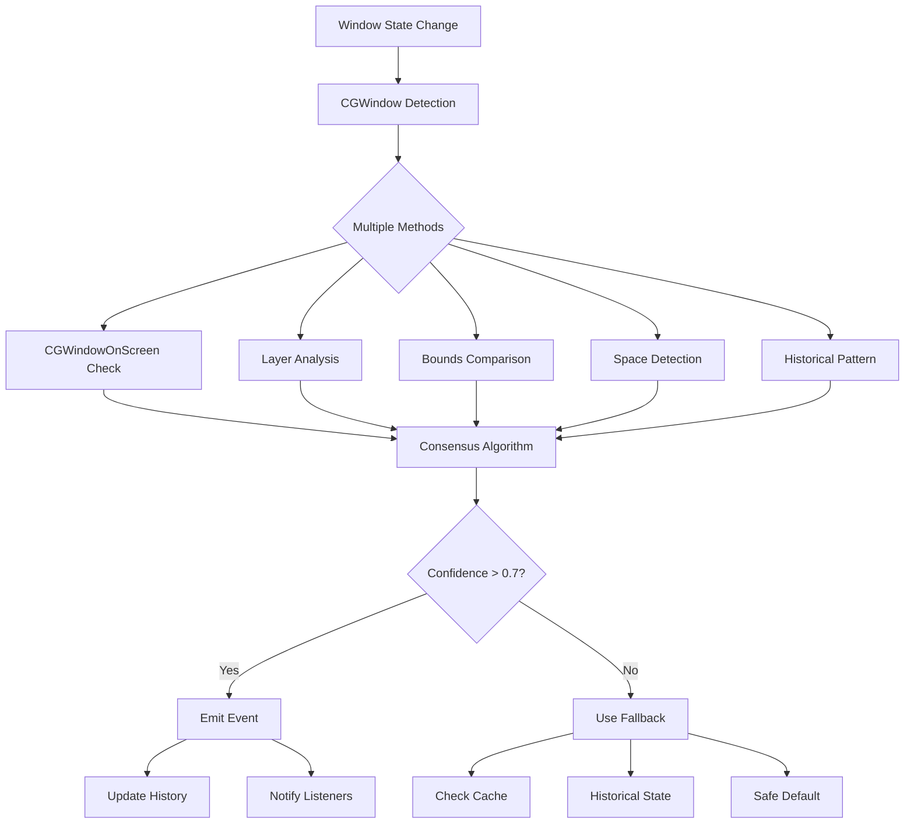

# Window State Detector Integration Guide

## Overview

The `WindowStateDetector` module provides a robust, production-ready system for detecting window states (minimized, fullscreen, hidden, etc.) and desktop/space changes on macOS. It uses multiple detection methods with consensus algorithms and smart fallbacks to ensure accuracy.

## Key Features

### 1. Multi-Method Detection
- **CGWindow API**: Primary method using Core Graphics window information
- **NSWindow API**: When window references are available
- **Space/Desktop Detection**: Using private CGS APIs
- **Historical Pattern Analysis**: Learning from past state transitions
- **Consensus Algorithm**: Weighted voting from multiple methods

### 2. Confidence Scoring
Each detection method has a confidence weight:
- `CGWindowOnScreen`: 0.9 (very reliable)
- `NSWindowOcclusion`: 0.95 (most reliable when available)
- `CGWindowBounds`: 0.85 (reliable for fullscreen detection)
- `CGWindowLayer`: 0.8 (good for minimized detection)
- `HistoricalPattern`: 0.6 (supportive evidence)

### 3. Smart Fallbacks
- Cache recent detections (50ms cache duration)
- Historical state tracking
- Predictive state detection based on patterns
- Safe defaults when confidence is low

## Integration with App Switcher

### Step 1: Update AppSwitcher Enhanced

```rust
// src/core/app_switcher_enhanced.rs

use crate::core::window_state_detector::{WindowStateDetector, WindowState, WindowStateInfo};

pub struct EnhancedAppMonitor {
    // ... existing fields ...
    window_state_detector: Arc<WindowStateDetector>,
    window_state_poll_interval: Duration,
    window_state_thread: Option<JoinHandle<()>>,
}

impl EnhancedAppMonitor {
    pub fn new(mtm: MainThreadMarker) -> Self {
        let window_state_detector = Arc::new(WindowStateDetector::new());
        
        // Initialize monitors on startup
        window_state_detector.update_monitors().ok();
        window_state_detector.update_spaces().ok();
        
        Self {
            // ... existing initialization ...
            window_state_detector,
            window_state_poll_interval: Duration::from_millis(100),
            window_state_thread: None,
        }
    }
    
    pub fn start_monitoring(&mut self) -> Result<(), String> {
        // ... existing code ...
        
        // Start window state polling thread
        self.start_window_state_polling();
        
        Ok(())
    }
    
    fn start_window_state_polling(&mut self) {
        let detector = Arc::clone(&self.window_state_detector);
        let interval = self.window_state_poll_interval;
        let windows_to_track = Arc::clone(&self.tracked_windows);
        
        let handle = std::thread::spawn(move || {
            loop {
                // Update monitor configuration periodically
                detector.update_monitors().ok();
                detector.update_spaces().ok();
                
                // Get current windows to track
                let windows = windows_to_track.lock().unwrap();
                let window_list: Vec<(u32, i32)> = windows
                    .iter()
                    .map(|(wid, info)| (*wid, info.pid))
                    .collect();
                drop(windows);
                
                // Batch detect all windows
                let states = detector.detect_multiple_windows(&window_list);
                
                // Process state changes
                for (window_id, state_info) in states {
                    Self::handle_window_state_change(window_id, state_info);
                }
                
                std::thread::sleep(interval);
            }
        });
        
        self.window_state_thread = Some(handle);
    }
    
    fn handle_window_state_change(window_id: u32, state_info: WindowStateInfo) {
        // Emit events for state changes
        match state_info.state {
            WindowState::Minimized => {
                println!("Window {} minimized (confidence: {:.2})", 
                    window_id, state_info.confidence);
            }
            WindowState::Fullscreen => {
                println!("Window {} entered fullscreen (confidence: {:.2})", 
                    window_id, state_info.confidence);
            }
            WindowState::Hidden => {
                println!("Window {} hidden (confidence: {:.2})", 
                    window_id, state_info.confidence);
            }
            _ => {}
        }
        
        // Update internal state
        // Notify listeners
        // etc.
    }
}
```

### Step 2: Extend Event Types

```rust
// src/core/app_switcher_types.rs

#[derive(Debug, Clone)]
pub enum EnhancedAppSwitchEvent {
    // ... existing events ...
    
    // New window state events
    WindowMinimized {
        app_info: ExtendedAppInfo,
        window_id: u32,
        confidence: f32,
    },
    WindowRestored {
        app_info: ExtendedAppInfo,
        window_id: u32,
        confidence: f32,
    },
    WindowFullscreenEntered {
        app_info: ExtendedAppInfo,
        window_id: u32,
        monitor_id: Option<u32>,
        confidence: f32,
    },
    WindowFullscreenExited {
        app_info: ExtendedAppInfo,
        window_id: u32,
        confidence: f32,
    },
    WindowMovedToSpace {
        app_info: ExtendedAppInfo,
        window_id: u32,
        from_space: Option<u64>,
        to_space: u64,
    },
    WindowClosed {
        app_info: ExtendedAppInfo,
        window_id: u32,
    },
}
```

### Step 3: Enhanced Window Info Structure

```rust
// Add to existing WindowInfo structure
pub struct EnhancedWindowInfo {
    // ... existing fields ...
    
    // New state fields
    pub state: WindowState,
    pub state_confidence: f32,
    pub is_minimized: bool,
    pub is_fullscreen: bool,
    pub is_animating: bool,
    pub space_id: Option<u64>,
    pub monitor_id: Option<u32>,
    pub last_state_change: Instant,
    pub detection_methods: Vec<DetectionMethod>,
}
```

## Usage Examples

### Basic Usage

```rust
use crate::core::window_state_detector::WindowStateDetector;

fn main() {
    let detector = WindowStateDetector::new();
    
    // Detect state for a specific window
    let window_id = 12345;
    let pid = 678;
    
    let state_info = detector.detect_window_state(window_id, pid);
    
    println!("Window {} state: {:?} (confidence: {:.2}%)", 
        window_id, 
        state_info.state, 
        state_info.confidence * 100.0
    );
    
    // Simple API methods
    if detector.is_minimized(window_id, pid) {
        println!("Window is minimized");
    }
    
    if detector.is_fullscreen(window_id, pid) {
        println!("Window is in fullscreen mode");
    }
    
    if let Some(space_id) = detector.get_window_space(window_id, pid) {
        println!("Window is on space {}", space_id);
    }
}
```

### Batch Detection (Efficient)

```rust
fn detect_all_windows(app_infos: &[AppInfo]) {
    let detector = WindowStateDetector::new();
    
    // Prepare window list
    let windows: Vec<(u32, i32)> = app_infos
        .iter()
        .flat_map(|app| {
            app.windows.iter().map(|w| (w.id, app.pid))
        })
        .collect();
    
    // Batch detect all windows
    let states = detector.detect_multiple_windows(&windows);
    
    // Process results
    for (window_id, state_info) in states {
        if state_info.confidence > 0.7 {
            process_window_state(window_id, state_info);
        }
    }
}
```

### With Fallback Chain

```rust
fn get_window_state_safe(window_id: u32, pid: i32) -> WindowState {
    let detector = WindowStateDetector::new();
    
    // This uses the full fallback chain
    let state_info = detector.get_window_state_with_fallback(window_id, pid);
    
    // Even with low confidence, we get a reasonable state
    state_info.state
}
```

## Event Flow



## Performance Optimization

### 1. Caching Strategy
- 50ms cache for individual window detections
- 1 second cache cleanup interval
- Batch detection for multiple windows

### 2. Polling Optimization
```rust
// Adaptive polling based on activity
let poll_interval = if recent_state_changes > 5 {
    Duration::from_millis(50)  // Fast polling during activity
} else {
    Duration::from_millis(200) // Slower polling when idle
};
```

### 3. Selective Detection
```rust
// Only detect state for visible/important windows
let important_windows = windows.iter()
    .filter(|w| w.is_frontmost || w.recently_active)
    .collect();
```

## Troubleshooting

### Issue: Low Confidence Scores
**Solution**: Check if Screen Recording permission is enabled. Some window properties require this permission.

### Issue: Space Detection Not Working
**Solution**: The CGS private APIs may not be available. The detector will gracefully fall back to other methods.

### Issue: High CPU Usage
**Solution**: 
1. Increase polling interval
2. Use batch detection
3. Enable caching
4. Reduce number of tracked windows

### Issue: Incorrect Fullscreen Detection
**Solution**: Ensure monitors are updated regularly:
```rust
detector.update_monitors().unwrap();
```

## Testing

### Unit Tests
```rust
#[test]
fn test_minimized_detection() {
    let detector = WindowStateDetector::new();
    
    // Create mock window data
    let mock_window = create_mock_minimized_window();
    
    let state = detector.detect_window_state(mock_window.id, mock_window.pid);
    
    assert_eq!(state.state, WindowState::Minimized);
    assert!(state.confidence > 0.8);
}
```

### Integration Tests
```rust
#[test]
fn test_real_window_detection() {
    let detector = WindowStateDetector::new();
    
    // Get actual window from system
    if let Some(window) = get_frontmost_window() {
        let state = detector.detect_window_state(window.id, window.pid);
        
        // Should detect something with reasonable confidence
        assert!(state.confidence > 0.5);
        assert_ne!(state.state, WindowState::Unknown);
    }
}
```

## Best Practices

1. **Always check confidence scores** - Don't trust detections below 0.5 confidence
2. **Use batch detection** for multiple windows - More efficient than individual calls
3. **Update monitors periodically** - Display configuration can change
4. **Handle Unknown states gracefully** - Have sensible defaults
5. **Log detection methods** - Helps debug issues in production
6. **Test with various window states** - Minimized, fullscreen, hidden, multiple monitors
7. **Consider animation states** - Windows may be transitioning between states

## Future Enhancements

1. **Machine Learning** - Train model on state transition patterns
2. **Window Screenshot Analysis** - Use vision APIs for additional validation
3. **Accessibility API Integration** - Get additional window metadata
4. **Performance Profiling** - Optimize hot paths
5. **State Prediction** - Predict future states based on user behavior
6. **Custom Detection Plugins** - Allow app-specific detection methods

## API Reference

See inline documentation in `src/core/window_state_detector.rs` for complete API details.
